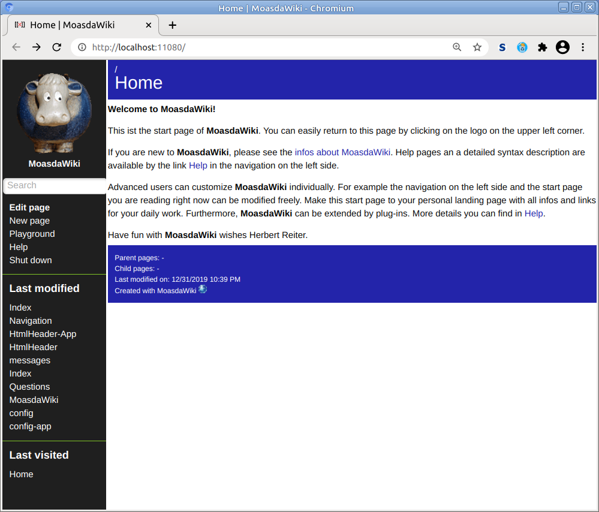
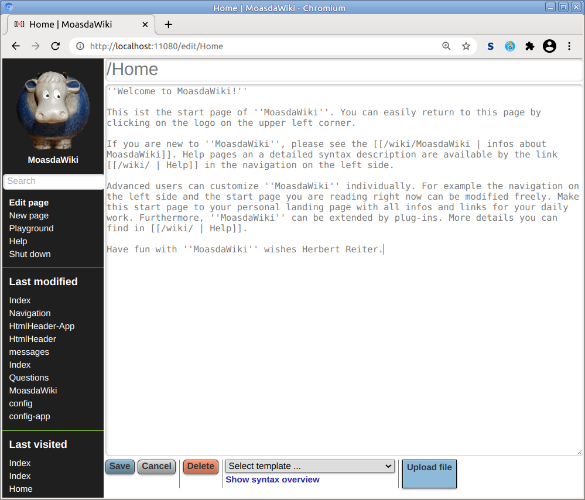
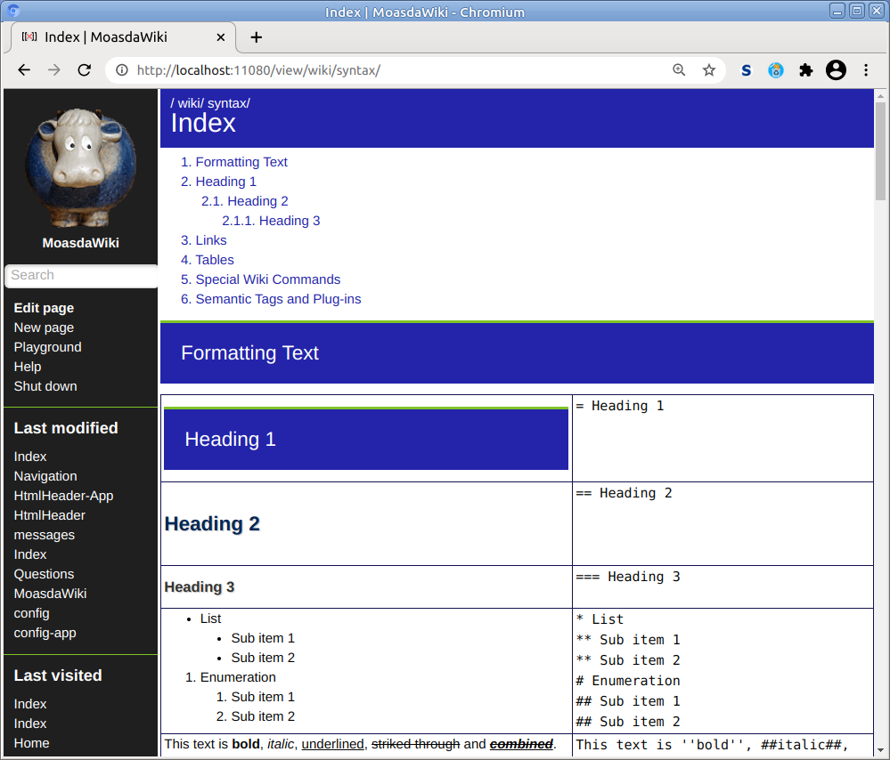

# MoasdaWiki Server

## Description

MoasdaWiki Server is a privacy-friendly and interactive knowledge management
tool. It provides a browser-based GUI to search, create, and modify content in
Wiki style.

For documentation see https://moasdawiki.net/.

### Key features

- Easy usability
- No installation required, can be unzipped and run on a USB stick
- Runs on any OS with a Java VM 1.8 or higher
- Debian package for easy installation available
- [MoasdaWiki App](https://gitlab.com/moasdawiki/moasdawiki-app) available,
  always have a copy of the Wiki content on your mobile device
- Data privacy by design: Stores content only on the local computer, never
  establishes a cloud connection
- Free/Libre and Open Source Software (FLOSS)

### Feature list

- Powerful syntax, supports tables and images
- Fast full-text search
- Page templates to create uniform looking pages
- Full customizable graphical user interface
  - Navigation panel can be modified
  - Page layout for view in browser and for printing is defined by CSS stylesheet
  - Page header and footer can be modified
  - Customizable HTML header, e.g. to include your own CSS stylesheets and JavaScript libraries
  - Configuration file with several options
- Internationalization via message files
- List of recently modified and viewed pages
- Built-in lightweight web server, no external web server required
- Stores pages as text files in a folder in the local file system;
  for backups just make a copy of that folder.

## Screenshots





## Download and Run
### For Debian/Ubuntu

1. Download the latest DEB package file from the
   [releases page](https://gitlab.com/moasdawiki/moasdawiki-server/-/releases).
2. Install the package.
3. Open the URL http://localhost:11080/ in your web browser.

MoasdaWiki stores the repository files in the folder
`/var/lib/moasdawiki/repository`. I recommend adding that folder to your backup
tool. The log files are in the folder `/var/log/moasdawiki/`.

### Other environments

1. Ensure that Java 1.8 or higher is installed.
2. Download the latest ZIP bundle from the
   [releases page](https://gitlab.com/moasdawiki/moasdawiki-server/-/releases).
3. Unzip the file `moasdawiki-server-x.y.z.zip` in a new folder.
4. Open a Terminal.
5. Go to the folder that contains the file `moasdawiki-server-x.y.z.jar`.
6. Run the server: `java -jar moasdawiki-server-x.y.z.jar shadow-repository/en`
7. Open the URL http://localhost:11080/ in your web browser.

If the Wiki server runs on a different host, use the host name or its IP address
instead of `localhost`. The default port is 11080. You can change it in the file
`shadow-repository/en/config.txt`.

## Build

Clone the GitLab repository and run:

```
gradle build
```

Afterwards, you will find a ZIP file in the folder ```build/distributions/```.

## User guide

A detailed description of the MoasdaWiki server is bundled in the downloaded ZIP file.
To open the user guide click on the "Help" link in the navigation panel or open the URL
http://localhost:11080/view/wiki/

## Support

If you have questions or any problems you can contact me via [support@moasdawiki.net]().

## License

MoasdaWiki server is licensed under AGPL-3.0-only &ndash; see the
[LICENSE](LICENSE) file for details.

Copyright (C) Herbert Reiter
